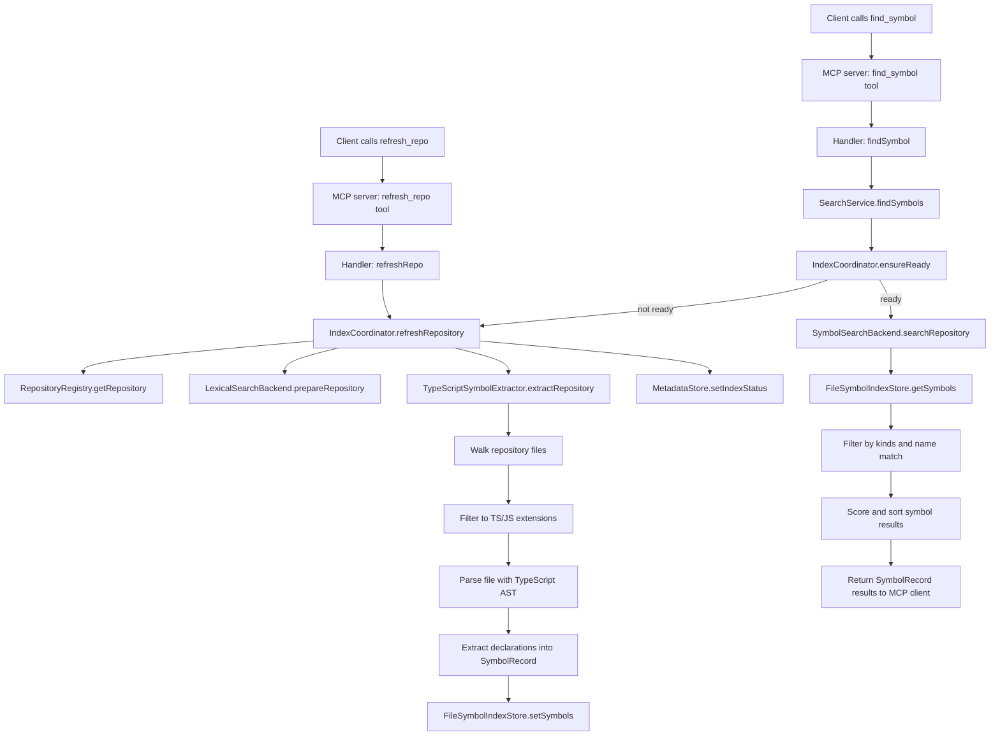

# CodeAtlas Architecture

## Objectives

CodeAtlas is designed as a local-first retrieval system for codebases used by GitHub Copilot through MCP.

The architecture is constrained by:

- local indexing only
- local metadata and database only
- multi-repository operation
- one very large repository up to 10GB
- a phase 1 lexical implementation that does not lock out future hybrid retrieval

## Architectural Boundaries

The core design rule is strict separation of concerns.

### Storage concerns

Handled by:

- repository registry persistence
- metadata store persistence
- future chunk store persistence
- future vector index persistence

These layers own how data is stored locally, not how it is searched or exposed through MCP.

### Indexing concerns

Handled by:

- index coordinator
- lexical index preparation and refresh
- current symbol extraction pipeline
- future chunking pipelines
- future embedding pipelines

This layer decides when and how artifacts are built or refreshed.

### Retrieval concerns

Handled by:

- search service
- lexical backend abstraction
- future semantic backend abstraction
- future rank fusion and reranking

This layer is responsible for result generation and ranking, not file transport or metadata persistence.

### MCP transport concerns

Handled by:

- tool schemas
- tool handlers
- stdio server bootstrap

This layer maps stable external contracts to internal services. It should remain stable as internals evolve.

## Phase 1 Components

## Package Layout

The repository is split into three top-level packages.

### `packages/core`

Owns product logic and local persistence abstractions.

Includes:

- configuration loading and management
- repository discovery
- repository registry
- metadata store
- source reader
- lexical search backend abstraction
- symbol extraction and symbol index storage
- symbol-aware search backend
- index coordination
- search services

### `packages/mcp-server`

Owns MCP transport only.

Includes:

- tool schemas
- tool handlers
- MCP server registration
- stdio bootstrap

### `packages/vscode-extension`

Owns VS Code-specific command and UI integration.

Includes:

- command palette actions for repository discovery and registration
- config file entry points
- repository status display helpers

### Repository Registry

Tracks locally registered repositories.

Responsibilities:

- register repositories by logical name and local path
- list configured repositories
- resolve repositories during search and source reads

Storage:

- local JSON today
- local SQLite later if registry query complexity grows

### Metadata Store

Tracks index status and backend readiness information.

Responsibilities:

- store repository index state
- record last refresh times
- track backend-specific metadata without leaking it into MCP contracts

Storage:

- local JSON today
- local SQLite later for richer operational metadata

### Index Coordinator

Coordinates refresh and readiness across repositories.

Responsibilities:

- prepare or refresh lexical index state
- prepare or refresh local symbol index state
- update metadata store status
- isolate per-repository refresh from other repositories

This design matters for the 10GB repository requirement because large repositories must be refreshable independently.

### Lexical Search Backend Abstraction

CodeAtlas keeps a `LexicalSearchBackend` interface so the retrieval layer is insulated from the concrete lexical engine. The current repository includes a ripgrep-backed bootstrap implementation for local development, but the intended production lexical path is Zoekt-backed indexing and lookup.

Responsibilities:

- build or refresh lexical index state for a repository
- return lexical matches for a repository
- remain independent from MCP transport
- keep the engine choice internal to core services

Why this matters:

- the bootstrap ripgrep path keeps development unblocked
- Zoekt provides the intended prebuilt lexical index for large repositories
- the `SearchService` and MCP tools do not change

### Zoekt Integration Direction

The lexical indexing decision is to use Zoekt directly rather than build a custom lexical engine inside CodeAtlas.

That means:

- `refresh_repo` should ultimately trigger a Zoekt repository index build or refresh
- `code_search` should ultimately query Zoekt-backed lexical indexes
- metadata remains owned by CodeAtlas even when lexical index files are produced by Zoekt
- the ripgrep path is a bootstrap and fallback implementation, not the long-term primary backend

### Source Reader

Reads requested source ranges from registered repositories.

Responsibilities:

- path normalization
- line-range reads
- traversal protection

### MCP Server

Exposes stable tool contracts:

- `list_repos`
- `register_repo`
- `code_search`
- `find_symbol`
- `semantic_search`
- `hybrid_search`
- `read_source`
- `get_index_status`
- `refresh_repo`

The `semantic_search` and `hybrid_search` tools exist now as placeholders so future retrieval upgrades do not require contract renames or transport changes.

### VS Code Extension

The extension is intentionally separate from MCP transport.

Responsibilities:

- discover repositories from workspace-adjacent folders
- register repositories through shared core services
- display local repository and index status through VS Code commands
- open and manage CodeAtlas configuration from the command palette

This avoids mixing VS Code APIs into the MCP server package.

## Result Contract

All retrieval paths converge on the same result shape:

```json
{
  "repo": "repo-name",
  "path": "src/file.ts",
  "start_line": 10,
  "end_line": 14,
  "snippet": "matched content",
  "score": 92.5,
  "source_type": "lexical"
}
```

`source_type` is future-safe and already supports:

- `lexical`
- `symbol`
- `semantic`
- `hybrid`

## Upgrade Path To Hybrid Retrieval

The design explicitly preserves the MCP boundary while allowing deeper internals later.

### Phase 2: symbol-aware retrieval

Add a symbol extraction pipeline and symbol index behind retrieval services.

Impact:

- implemented as local TypeScript-powered symbol extraction for TS and JS codebases
- adds `find_symbol` as a dedicated symbol lookup surface while preserving existing lexical contracts
- existing lexical MCP contracts unchanged
- symbol refresh should remain coordinated with the same repository refresh lifecycle used for Zoekt

### Symbol Index Flow

The current symbol-aware path has two main execution flows: indexing and lookup.



Execution notes:

- `refresh_repo` is the point where lexical index readiness and symbol index generation are performed together.
- symbol extraction is file-based and currently only runs on `.ts`, `.tsx`, `.js`, `.jsx`, `.mts`, `.cts`, `.mjs`, and `.cjs` files.
- `find_symbol` does not re-parse the repository on every query; it reads the locally persisted symbol index and ranks matches from that cache.
- `ensureReady` is the guard between lookup and indexing. If a repository has not been indexed yet, lookup will trigger the refresh path first.

### Phase 3: chunk-based indexing and local embeddings

Add chunk storage and a local embedding pipeline.

Impact:

- metadata store may track chunk and embedding versions
- semantic backend is introduced behind `semantic_search`
- source result contract unchanged

### Phase 4: vector search and hybrid ranking

Add vector retrieval and hybrid candidate merging.

Impact:

- `hybrid_search` becomes fully implemented
- `SearchService` composes lexical and semantic candidates
- MCP handlers still return the same shape

## Agent Retrieval Strategy

Agents should use the retrieval layers as complementary signals rather than treating any single layer as sufficient on its own.

### Retrieval order by query shape

When the agent already knows an exact code symbol name:

- prefer `find_symbol` first to locate structured definitions
- use `read_source` to ground the result in nearby code
- use lexical search afterward only when the agent needs usages, related strings, or broader textual evidence

When the agent knows an exact token or text string but it is not necessarily a code symbol:

- prefer lexical retrieval through `code_search`
- use the lexical backend to find exact matches for configuration keys, log text, error messages, SQL fragments, and protocol fields
- use source reads to validate the match before drawing conclusions

When the agent only has a vague natural-language intent:

- prefer semantic retrieval first once `semantic_search` is implemented
- treat semantic results as high-recall candidates rather than final answers
- feed semantic candidates back into symbol or lexical retrieval for precise verification
- use `read_source` as the final grounding step before the agent acts on the result

### Design implications

- semantic retrieval does not replace lexical retrieval; it expands recall when exact identifiers are unknown
- symbol retrieval remains the highest-precision path for exact code entities
- lexical retrieval remains the highest-confidence path for exact text matching
- hybrid retrieval should combine semantic recall with lexical and symbol verification rather than bypassing those layers

## Large Repository Considerations

For the up-to-10GB repository target, the architecture assumes:

- repository-local refresh operations
- no requirement to rebuild all repositories together
- independent metadata and index state per repository
- a Zoekt-backed lexical engine that avoids whole-workspace scans at query time

The bootstrap implementation is intentionally conservative. It gets the public architecture right first so the move to Zoekt does not force transport redesign.