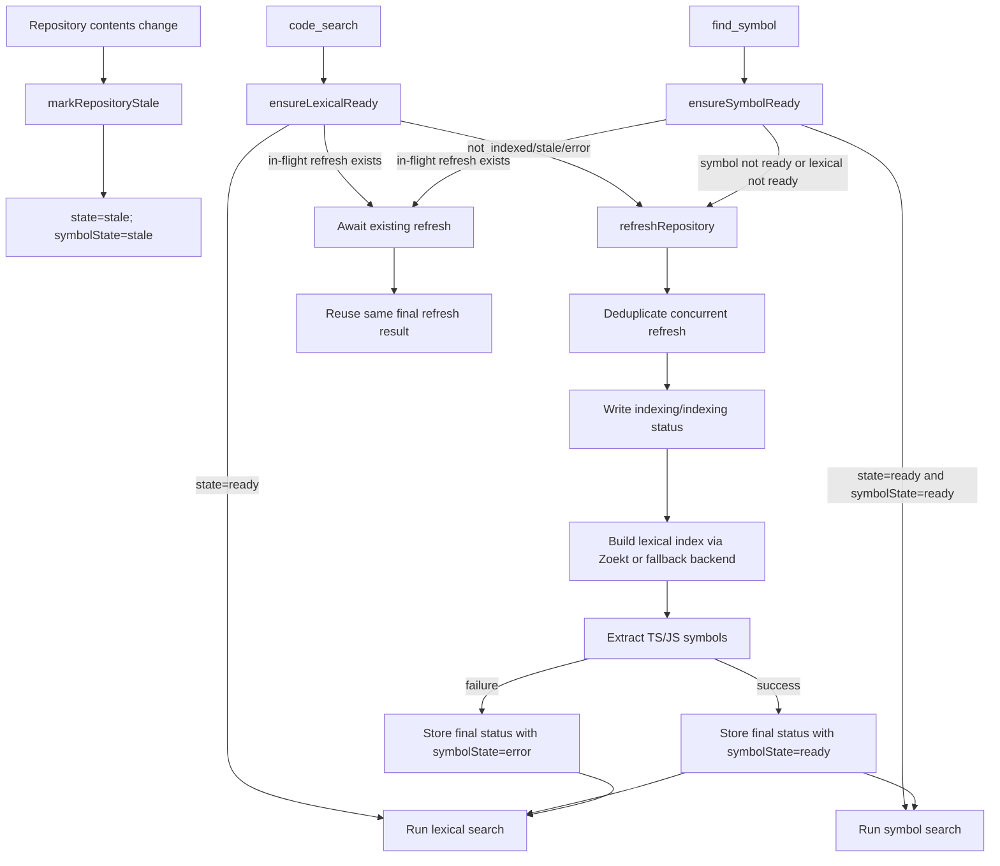
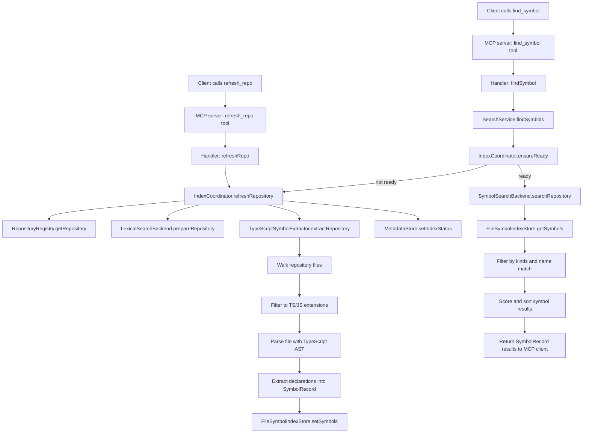

# CodeAtlas Architecture

## Objectives

CodeAtlas is designed as a local-first retrieval system for codebases used by GitHub Copilot through MCP.

The architecture is constrained by:

- local indexing only
- local metadata and database only
- multi-repository operation
- one very large repository up to 10GB
- a phase 1 lexical implementation that does not lock out future hybrid retrieval

## Architectural Boundaries

The core design rule is strict separation of concerns.

### Storage concerns

Handled by:

- repository registry persistence
- metadata store persistence
- future chunk store persistence
- future vector index persistence

These layers own how data is stored locally, not how it is searched or exposed through MCP.

### Indexing concerns

Handled by:

- index coordinator
- lexical index preparation and refresh
- current symbol extraction pipeline
- future chunking pipelines
- future embedding pipelines

This layer decides when and how artifacts are built or refreshed.

### Retrieval concerns

Handled by:

- search service
- lexical backend abstraction
- future semantic backend abstraction
- future rank fusion and reranking

This layer is responsible for result generation and ranking, not file transport or metadata persistence.

### MCP transport concerns

Handled by:

- tool schemas
- tool handlers
- stdio server bootstrap

This layer maps stable external contracts to internal services. It should remain stable as internals evolve.

## Package Layout

The repository is split into three top-level packages.

### `packages/core`

Owns product logic and local persistence abstractions.

Includes:

- configuration loading and management
- repository discovery
- repository registry
- metadata store
- source reader
- lexical search backend abstraction
- symbol extraction and symbol index storage
- symbol-aware search backend
- index coordination
- search services

### `packages/mcp-server`

Owns MCP transport only.

Includes:

- tool schemas
- tool handlers
- MCP server registration
- stdio bootstrap

### `packages/vscode-extension`

Owns VS Code-specific command and UI integration.

Includes:

- command palette actions for repository discovery and registration
- config file entry points
- repository status display helpers

### Repository Registry

Tracks locally registered repositories.

Responsibilities:

- register repositories by logical name and local path
- list configured repositories
- resolve repositories during search and source reads

Storage:

- local JSON today
- local SQLite later if registry query complexity grows

### Metadata Store

Tracks index status and backend readiness information.

Responsibilities:

- store repository index state
- record last refresh times
- distinguish `not_indexed`, `indexing`, `ready`, `stale`, and `error` states
- track backend-specific metadata without leaking it into MCP contracts

Storage:

- local JSON today
- local SQLite later for richer operational metadata

### Index Coordinator

Coordinates refresh and readiness across repositories.

Responsibilities:

- prepare or refresh lexical index state
- prepare or refresh local symbol index state
- update metadata store status
- isolate per-repository refresh from other repositories

This design matters for the 10GB repository requirement because large repositories must be refreshable independently.

### Lexical Search Backend Abstraction

CodeAtlas keeps a `LexicalSearchBackend` interface so the retrieval layer is insulated from the concrete lexical engine. The current primary lexical path is Zoekt-backed indexing and lookup, while a ripgrep-backed bootstrap implementation remains available for development and troubleshooting.

Responsibilities:

- build or refresh lexical index state for a repository
- return lexical matches for a repository
- remain independent from MCP transport
- keep the engine choice internal to core services

Why this matters:

- the bootstrap ripgrep path keeps development unblocked
- Zoekt provides the intended prebuilt lexical index for large repositories
- the `SearchService` and MCP tools do not change

### Zoekt Integration

The lexical indexing decision is to use Zoekt directly rather than build a custom lexical engine inside CodeAtlas.

Current state:

- `refresh_repo` triggers a Zoekt repository index build or refresh
- `code_search` queries Zoekt-backed lexical indexes
- metadata remains owned by CodeAtlas even when lexical index files are produced by Zoekt
- the ripgrep path is a bootstrap and fallback implementation, not the primary backend

Important scope note:

- Zoekt is used here as a lexical code search backend, not as a semantic retrieval backend
- upstream Zoekt can use code-related and symbol-related ranking signals, but the current CodeAtlas integration normalizes lexical file matches from Zoekt CLI output

### Zoekt Backend Integration

The integration keeps the lexical abstraction while Zoekt serves as the default implementation.

Backend selection rules:

- default lexical backend: Zoekt
- bootstrap fallback backend: ripgrep with naive scan fallback for development and troubleshooting
- runtime chooses Zoekt when the configured Zoekt executables and index paths are available
- runtime falls back to the bootstrap backend only when configuration explicitly allows development fallback behavior

Refresh flow:

- `register_repo` triggers `refresh_repo`
- `refresh_repo` calls the active lexical backend to build or refresh lexical state for exactly one repository
- in Zoekt mode, the lexical refresh step invokes Zoekt indexing for the repository root and configured index path
- after lexical refresh completes, the same repository refresh cycle continues through symbol extraction and metadata updates

Current coupling note:

- the current implementation couples lexical refresh and experimental symbol extraction in one repository refresh cycle
- this keeps readiness simple, but it also mixes pure Zoekt validation cost with symbol extraction cost
- near-term architecture work is to validate Zoekt indexing and repository update behavior first, then decide whether symbol refresh should be decoupled or reduced
- lexical readiness is now tracked separately from symbol readiness so lexical search can remain usable when symbol state is stale or failed

### Readiness And Refresh Flow

The current readiness path now distinguishes lexical readiness from stricter symbol readiness.



Notes:

- `code_search` only requires lexical readiness and no longer blocks on stale or failed symbol state.
- `find_symbol` still requires both lexical readiness and `symbolState=ready`.
- `refreshRepository` is shared across concurrent callers for the same repository.
- `markRepositoryStale` exists now as the explicit stale transition, but automatic repository change detection is still future work.

Query flow:

- `code_search` calls `SearchService.searchLexical`
- `SearchService` remains unaware of whether lexical matches came from Zoekt or the bootstrap backend
- in Zoekt mode, `searchRepository` reads ranked lexical hits from Zoekt output and normalizes them into the existing result contract
- in bootstrap mode, the existing ripgrep-backed implementation remains available for development use

Configuration:

- lexical backend configuration uses a backend-specific configuration model
- Zoekt configuration includes executable paths and index storage location
- bootstrap fallback configuration remains available but is treated as development-only behavior

Implementation boundary:

- CodeAtlas owns repository registration, refresh orchestration, metadata, optional symbol indexing, and MCP transport
- Zoekt owns lexical index creation and lexical query execution
- the lexical backend adapter inside CodeAtlas is responsible only for process invocation, output normalization, and error handling
- semantic indexing is not implemented and is not an active near-term workstream

### Source Reader

Reads requested source ranges from registered repositories.

Responsibilities:

- path normalization
- line-range reads
- traversal protection

### MCP Server

Exposes stable tool contracts:

- `list_repos`
- `register_repo`
- `code_search`
- `find_symbol`
- `semantic_search`
- `hybrid_search`
- `read_source`
- `get_index_status`
- `refresh_repo`

The `semantic_search` and `hybrid_search` tools exist as stable contract surfaces with placeholder implementations. Future retrieval upgrades will not require contract renames or transport changes.

### VS Code Extension

The extension is intentionally separate from MCP transport.

Responsibilities:

- discover repositories from workspace-adjacent folders
- register repositories through shared core services
- display local repository and index status through VS Code commands
- open and manage CodeAtlas configuration from the command palette

This avoids mixing VS Code APIs into the MCP server package.

## Result Contract

The lexical, semantic, and hybrid search contracts converge on the same result shape:

```json
{
  "repo": "repo-name",
  "path": "src/file.ts",
  "start_line": 10,
  "end_line": 14,
  "snippet": "matched content",
  "score": 92.5,
  "source_type": "lexical"
}
```

`source_type` is future-safe and already supports:

- `lexical`
- `semantic`
- `hybrid`

`find_symbol` remains a separate MCP tool with its own symbol-oriented response shape.

## Upgrade Path To Hybrid Retrieval

The design preserves the MCP boundary while allowing deeper internals later.

### Phase 2: experimental symbol lookup

Symbol extraction pipeline and symbol index behind retrieval services.

Current state:

- implemented as local TypeScript-powered symbol extraction for TS and JS codebases
- `find_symbol` is a dedicated symbol lookup surface while existing lexical contracts remain unchanged
- symbol refresh is coordinated with the same repository refresh lifecycle used for Zoekt

Remaining:

- determine whether custom symbol indexing adds enough value over Zoekt-first lexical workflows to justify continued maintenance
- decouple symbol refresh cost from lexical refresh if the feature is retained
- avoid broader custom symbol indexing scope until that keep or remove decision is made

### Symbol Index Flow

The symbol-aware path has two main execution flows: indexing and lookup.



Execution notes:

- `refresh_repo` is the point where lexical index readiness and symbol index generation are performed together.
- symbol extraction is file-based and currently only runs on `.ts`, `.tsx`, `.js`, `.jsx`, `.mts`, `.cts`, `.mjs`, and `.cjs` files.
- `find_symbol` does not re-parse the repository on every query; it reads the locally persisted symbol index and ranks matches from that cache.
- `ensureReady` is the guard between lookup and indexing. If a repository has not been indexed yet, lookup will trigger the refresh path first.
- this symbol path is currently experimental and should not drive broader architecture decisions until its value over Zoekt-first workflows is clear.

### Phase 3: chunk-based indexing and local embeddings (deferred)

Add chunk storage and a local embedding pipeline.

Impact:

- metadata store will track chunk and embedding versions
- semantic backend will be introduced behind `semantic_search`
- source result contract unchanged

### Phase 4: vector search and hybrid ranking (deferred)

Add vector retrieval and hybrid candidate merging.

Impact:

- `hybrid_search` becomes fully implemented
- `SearchService` composes lexical and semantic candidates
- MCP handlers still return the same shape

## Agent Retrieval Strategy

Agents should treat Zoekt-backed lexical search as the primary retrieval path in the current implementation.

### Retrieval order by query shape

When the agent already knows an exact code symbol name:

- use `find_symbol` as an optional helper when working in the currently supported TS and JS symbol path
- use `read_source` to ground the result in nearby code
- use lexical search afterward only when the agent needs usages, related strings, or broader textual evidence

When the agent knows an exact token or text string but it is not necessarily a code symbol:

- prefer lexical retrieval through `code_search`
- use the lexical backend to find exact matches for configuration keys, log text, error messages, SQL fragments, and protocol fields
- use source reads to validate the match before drawing conclusions

When the agent only has a vague natural-language intent:

- translate the request into lexical probes first because `semantic_search` is still a placeholder surface
- use `read_source` as the final grounding step before the agent acts on the result

### Design implications

- lexical retrieval is the highest-confidence active path today
- semantic retrieval does not replace lexical retrieval; it remains deferred work rather than an active capability
- symbol retrieval is currently an optional helper rather than the primary product focus
- lexical retrieval remains the highest-confidence path for exact text matching
- hybrid retrieval should combine semantic recall with lexical and symbol verification rather than bypassing those layers

## Large Repository Considerations

For the up-to-10GB repository target, the architecture assumes:

- repository-local refresh operations
- no requirement to rebuild all repositories together
- independent metadata and index state per repository
- a Zoekt-backed lexical engine that avoids whole-workspace scans at query time

The architecture is designed to be conservative about public contracts. It establishes the MCP boundary first so backend evolution does not force transport redesign.
